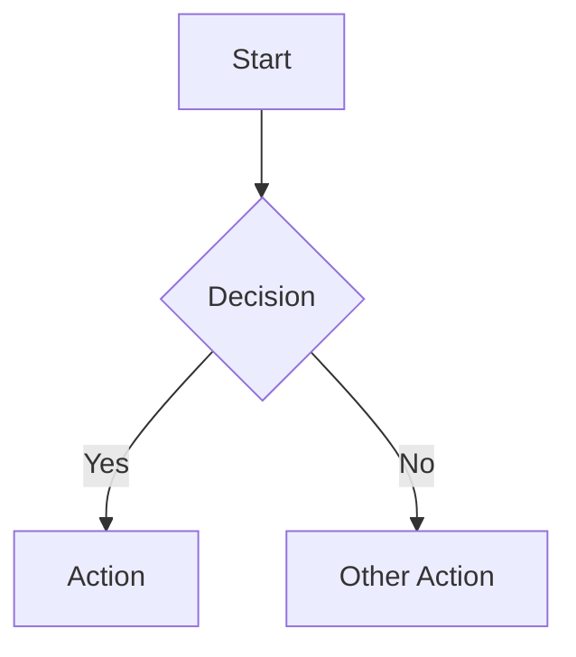

# Tech Design Conventions

## Location

All tech designs live in `tech-designs/` at the repo root. Filename: `{CDR-id}_{kebab-title}.md`

## What Goes In a Tech Design

A tech design is **implementation-ready documentation**. It should contain enough detail that a reviewer can evaluate the approach and an implementer (human or Claude) can write the code from it.

### Required Sections

1. **Problem** — What's broken, missing, or suboptimal? Why does this need to change?
2. **Current State** — How does the system work today? Include relevant code paths, data flow, and key files. Be specific — reference actual function names and file paths.
3. **Proposed Solution** — Very detailed. This is the core of the design.
   - Architecture and data flow
   - Flow charts, state diagrams, or sequence diagrams (Mermaid format)
   - Key design decisions with rationale
4. **Phase 0: Tests (TDD)** — Write tests BEFORE implementation. This is a required section.
   - List all test cases with setup data, steps, and expected outcomes
   - Include a **TDD ordering table** mapping each test to the implementation step that makes it pass
   - All tests should fail initially (RED). Implementation proceeds by making them pass (GREEN) one by one.
5. **Implementation Steps** — Actual high-level code changes.
   - Class/function stubs with comments explaining purpose and behavior
   - Interface definitions for new types
   - Key modifications to existing functions
6. **Fallback & Error Handling** — What happens when things fail?
7. **Verification** — How do we know it works?
8. **Misc** — Future considerations, open questions

### Quality Bar

A tech design is ready for review when:

- It comprehensively covers all pieces needed for the feature
- It's implementation-ready: contains key code changes as stubs with comments
- A reviewer can evaluate the approach without needing to read the full codebase
- An implementer can write the code from the design without ambiguity

### Iteration Process

1. **Initial prompt** — Write a comprehensive prompt with full context
2. **Iteration loop** — Read design -> Check against actual code -> Find gaps -> Refactor -> Read again
3. **Self-review** — Triple check: comprehensive, consistent, no gaps

## What Does NOT Go In a Tech Design

- **Obsidian notes or vault references**
- **Vague hand-waving** — "We'll figure this out later" is not a design. Flag it as an open question.

## Diagrams

Use Mermaid syntax for diagrams.

